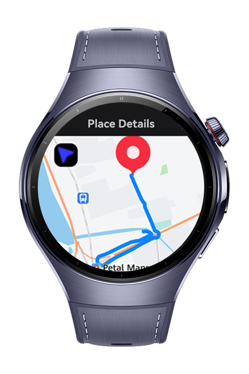

> **Note:** To access all shared projects, get information about environment setup, and view other guides, please visit [Explore-In-HMOS-Wearable Index](https://github.com/Explore-In-HMOS-Wearable/hmos-index).

# ParkingMate

**ParkingMate** is a HarmonyOS-based atomic service that helps users remember where they parked their car. With a single button, it saves the current location using **Location Kit** and later guides the user back to that point using **MapKit** navigation features.

This app is designed to simplify your urban experience—no more wandering in large parking lots or city streets searching for your car.

# Preview

<p align="left">
  
  
  
</p>

# Use Cases

- **Save Current Location**: Tap the button once after parking to store your GPS location.
- **Navigate to Parked Location**: Tap the same button again to open a live map and get directed back to your car.
- **Offline Memory Helper**: Perfect for malls, airports, stadiums, or unfamiliar city areas.
- **Minimal UI**: Designed for quick interactions via wearable devices.

# Tech Stack

- **Languages**: ArkTS (TypeScript for HarmonyOS)
- **UI Framework**: ArkUI (declarative HarmonyOS UI)
- **MapKit**: For rendering maps and route guidance
- **Location Kit**: For obtaining the device’s current latitude and longitude
- **Storage**: In-memory and file-based saving of coordinates

# Directory Structure

```text
entry/src/main/ets/
├── common/
│ └── types.ets # Custom type definitions
│
├── components/
│ └── SearchInput.ets # Optional search UI
│
├── entryability/
│ └── EntryAbility.ets # App entry launcher
│
├── entrybackupability/
│ └── EntryBackupAbility.ets # Backup widget/service entry
│
├── pages/
│ ├── HomePage.ets # Main page: button for Save/Navigate
│ ├── Index.ets # App entry point
│ └── PlaceDetailPage.ets # Detailed map view of location
│
├── services/
│ ├── GlobalContext.ets # App context management
│ ├── LocationService.ets # Uses LocationKit to fetch coordinates
│ ├── NavigationService.ets # Launches MapKit navigation
│ └── SiteService.ets # Manages site metadata (optional)
│
├── resources/
│ └── base/
│ └── element/
│ ├── color.json
│ ├── float.json
│ └── string.json
```

# Constraints and Restrictions

- **Location Accuracy**: May vary based on signal strength or indoor settings.
- **Permissions**: Requires explicit runtime permission to access GPS and Maps.
- **Connectivity**: Navigation requires internet access and map services.

## Supported Device

- **HarmonyOS Phones** with LocationKit & MapKit support
- **Huawei Watch Series** (Map navigation may launch via connected phone)

# License

**ParkingMate** is released under the MIT License.  
See the [LICENSE](./LICENSE) file for more information.
